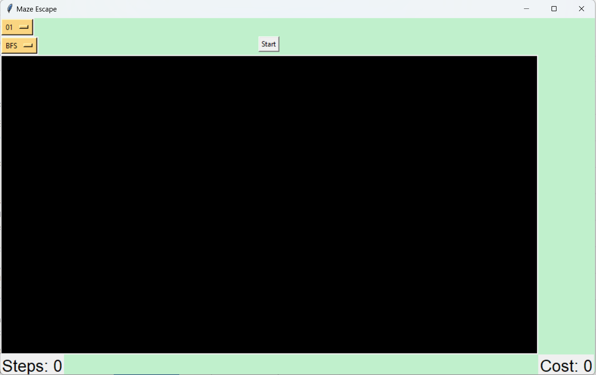
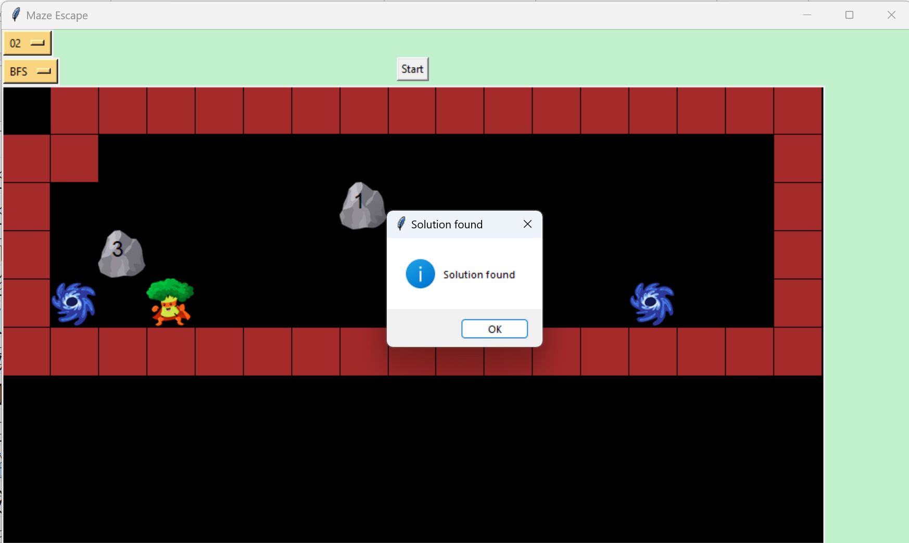
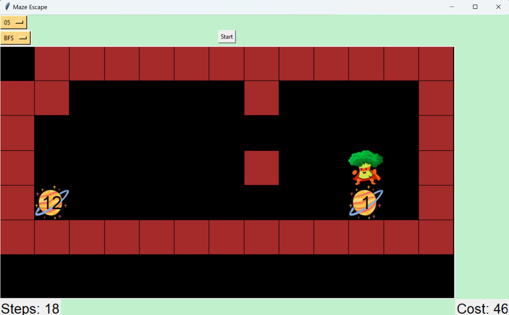

# AI-Project-1
This project apply global search: DFS, BFS, UCS, A* in game Ares's Adventure. This demonstrates the strengths and weaknesses of each search type.
## 1.Install dependency
```bash
pip install -r requirements.txt
```
## 2. Run
```bash
python src/main.py
```
## 3. How to use
 ### Initial Screen
 
 
 This is the initial interface displayed after the user runs the program. It includes 3 buttons:
 - "01": allows the user to select a level to display
 - "BFS": allows the user to choose a search method
 - "Start": press to begin visualizing the algorithm
 ### Find solution
 

 If the selected level has a solution, the screen will display a notification, and the user can click OK to view the detailed moves. On the other hand, if no solution exists, the user clicks OK to confirm and can then select a different level.
 ### Result
 

 This is the result display screen for a level. The bottom left corner shows "Steps," indicating the number of moves Ares made to complete the level. The bottom right corner shows "Costs," representing Ares' total corresponding cost.
## 4. Note
While the program is running on a level that has not yet been completed, the user is not allowed to select a different level or search type. This ensures that the output file is successfully generated.


